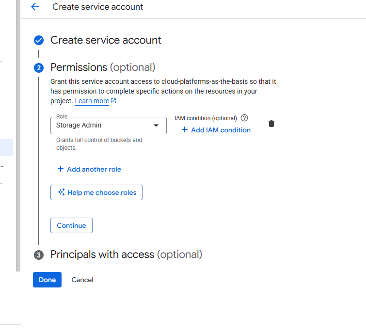
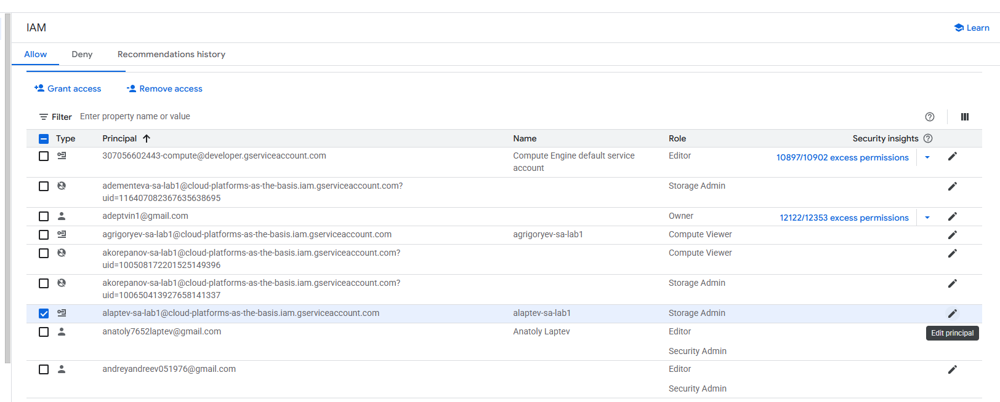
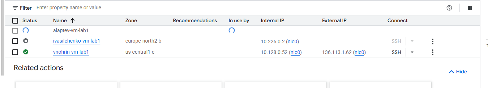
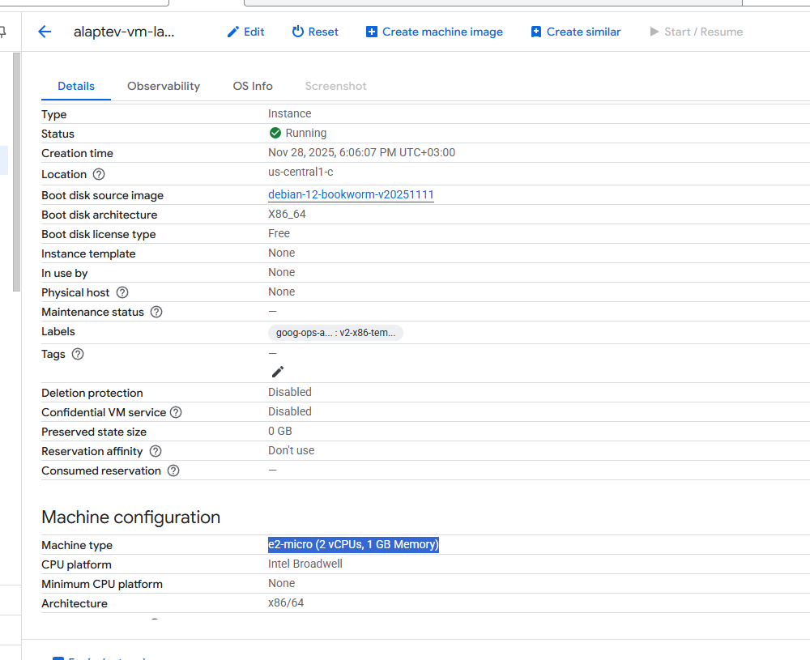
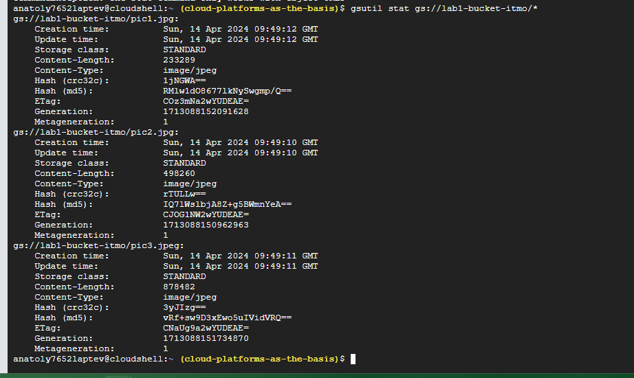
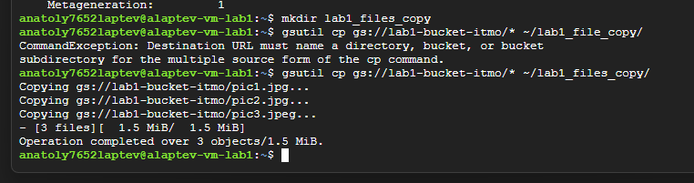
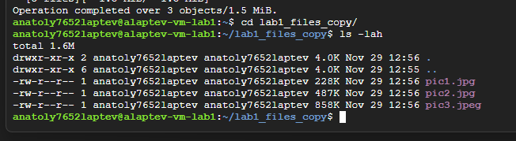
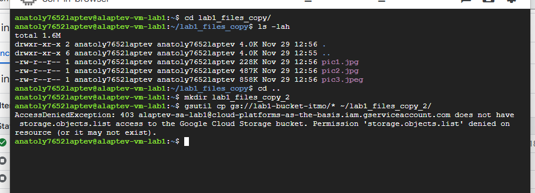

# Отчет по лабораторной №1

University: [ITMO University](https://itmo.ru/ru/)\
Faculty: FTMI\
Course: [Cloud platforms as the basis of technology entrepreneurship](https://itmo-ict-faculty.github.io/cloud-platforms-as-the-basis-of-technology-entrepreneurship/)\
Year: 2025/2026\
Group: U4225\
Author: Laptev Anatoly Aleksandrovich\
Lab: Lab1\
Date of create: 28.11.2025\
Date of finished: 01.12.2025

1. Зайдите в вкладку IAM, создайте service account с ролью Storage Admin\

2. Создать минимальный compute engine (виртуальную машину) с Machine type e2-micro в режиме spot.\

3. С помощью утилиты gsutils найдите бакет lab1-bucket-itmo и скопируйте 3 файла в локальную папку на VM.\
Используя команду ls -lah отобразите что эти файлы хранятся у вас на VM.\

4. Поменяйте права доступа для вашего service account с Storage Admin на Compute Viewer, \
попробуйте повторить пункт с копированием данных, сделать выводы.

5. Выводы таковы, что при изменении уровня доступа меняются права и не все действия можно сделать.