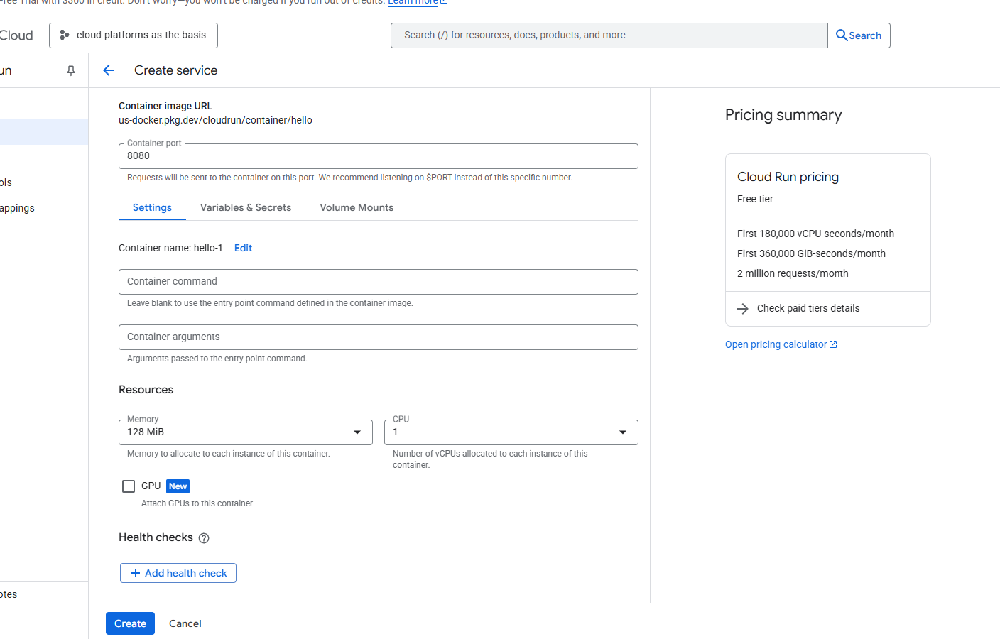
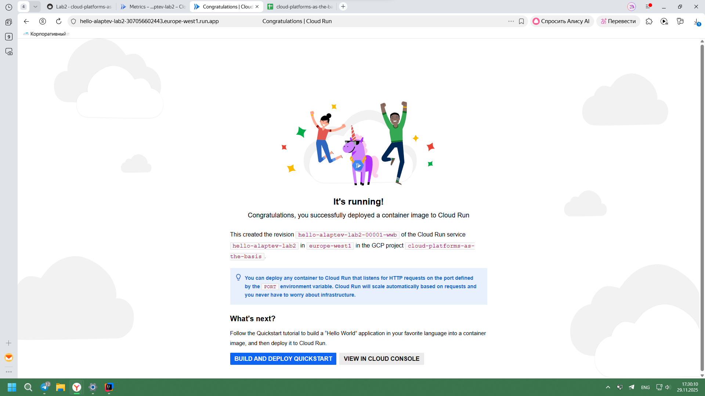
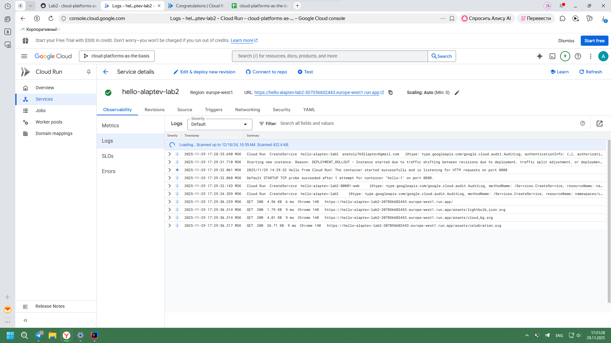
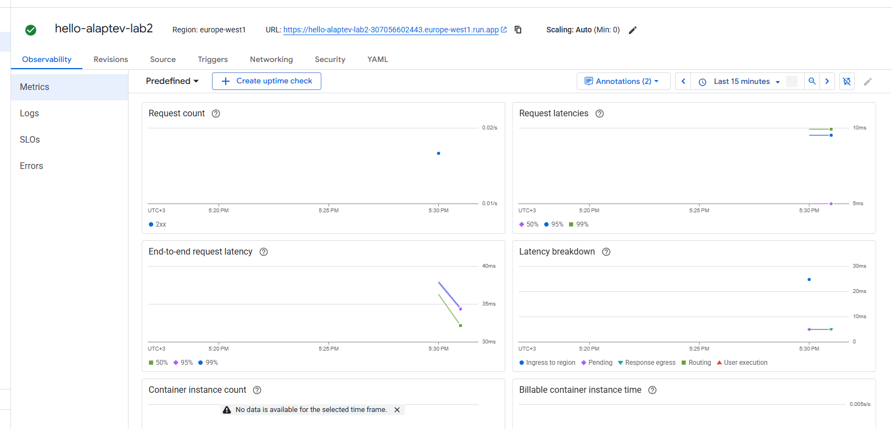
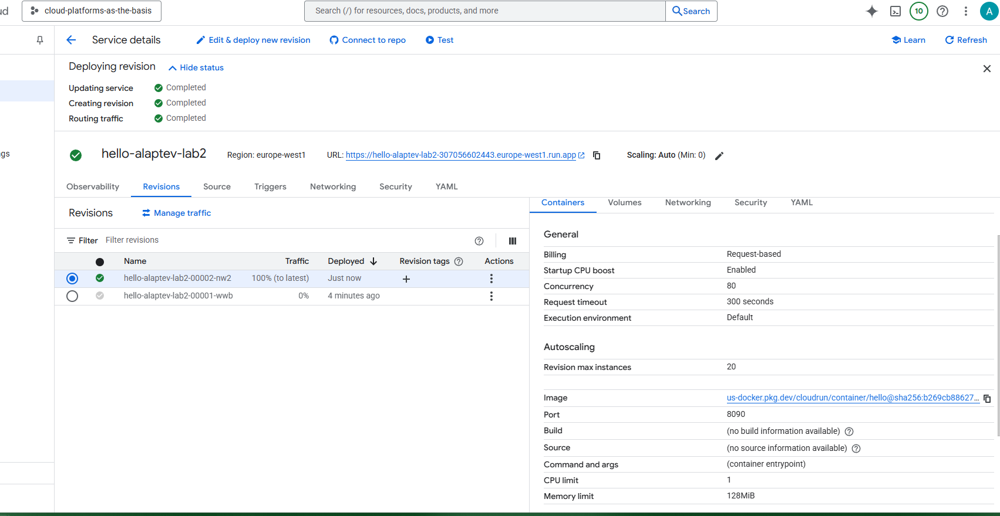
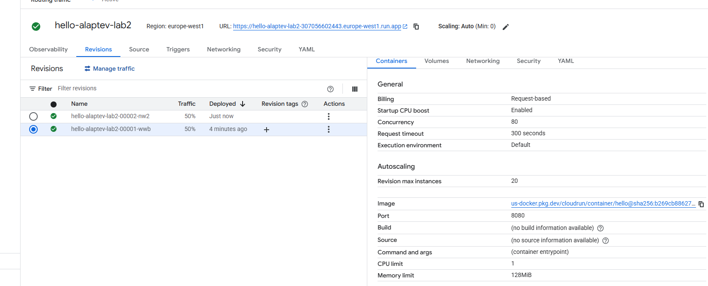
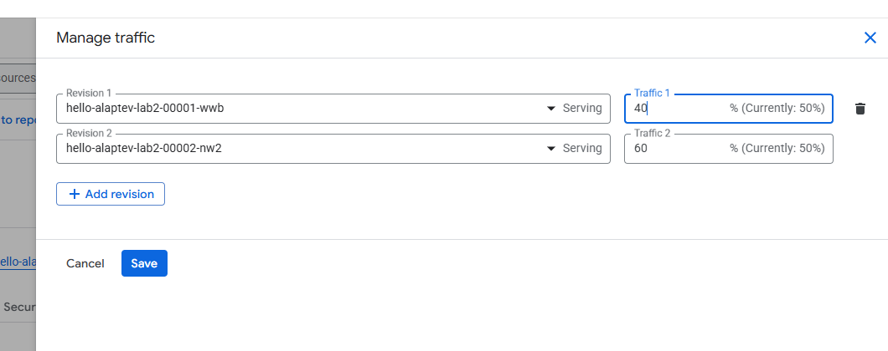
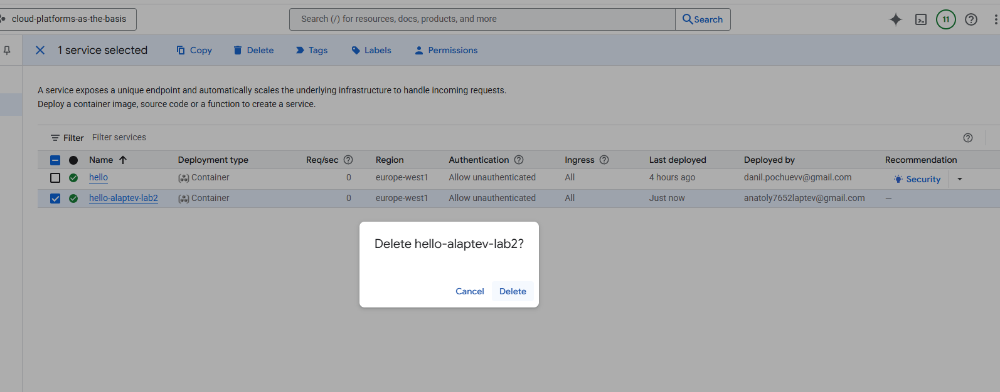

# Отчет по лабораторной №2

University: [ITMO University](https://itmo.ru/ru/)\
Faculty: FTMI\
Course: [Cloud platforms as the basis of technology entrepreneurship](https://itmo-ict-faculty.github.io/cloud-platforms-as-the-basis-of-technology-entrepreneurship/)\
Year: 2025/2026\
Group: U4225\
Author: Laptev Anatoly Aleksandrovich\
Lab: Lab2\
Date of create: 29.11.2025\
Date of finished: 01.12.2025

1. Создайте Cloud Run из представленного дефолтного сервиса Hello с минимальным количеством ресурсов.

2. Перейдите по ссылке предоставленной Cloud Run, протестируйте сервис.

3. Перейдите в разделы логи и метрики, проанализируйте их.

4. Измените ваш Cloud Run, поменяв порт на 8090, посмотрите что произойдет. \
Попробуйте попереключать трафик между версиями, сравните результаты работы.

