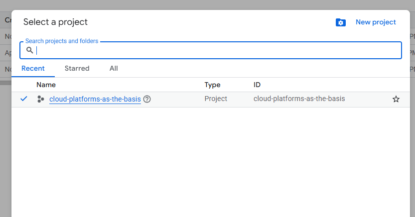
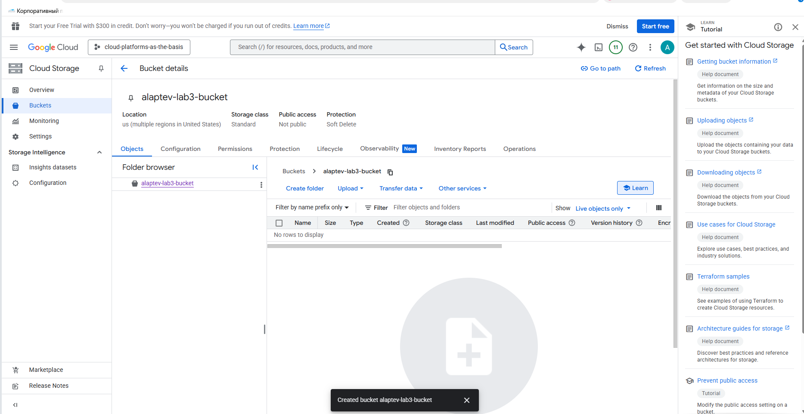
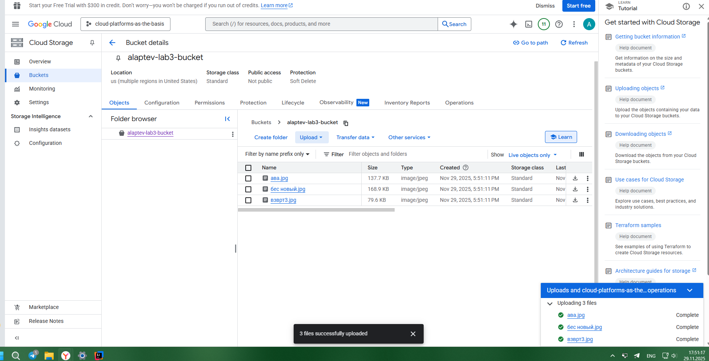
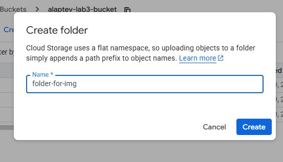
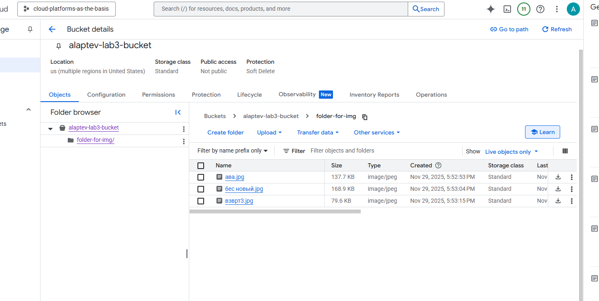
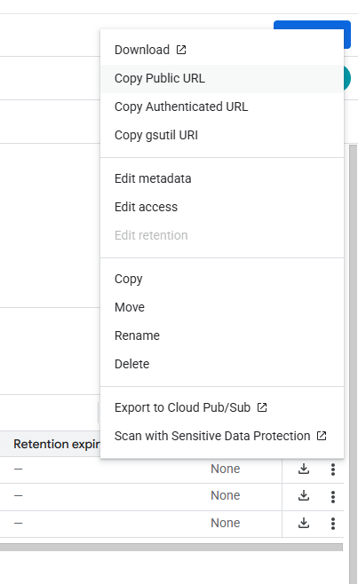

# Отчет по лабораторной №3

University: [ITMO University](https://itmo.ru/ru/)\
Faculty: FTMI\
Course: [Cloud platforms as the basis of technology entrepreneurship](https://itmo-ict-faculty.github.io/cloud-platforms-as-the-basis-of-technology-entrepreneurship/)\
Year: 2025/2026\
Group: U4225\
Author: Laptev Anatoly Aleksandrovich\
Lab: Lab3\
Date of create: 29.11.2025\
Date of finished: 01.12.2025

1. Выбрать существующий проект, в котором у вас есть соответствующие разрешения.\

2. Создать Cloud Storage bucket\

3. Загрузить 3-4 любых изображения в Cloud Storage bucket.\

4. Создать папку с любым названием и переместить файлы туда в пределах бакета.\

5. Настроить публичный доступ для ваших файлов в настройках приватности\

6. Создать ссылку на ваши файлы через контекстное меню файла\
https://storage.googleapis.com/alaptev-lab3-bucket/folder-for-img/%D0%B0%D0%B2%D0%B0.jpg
