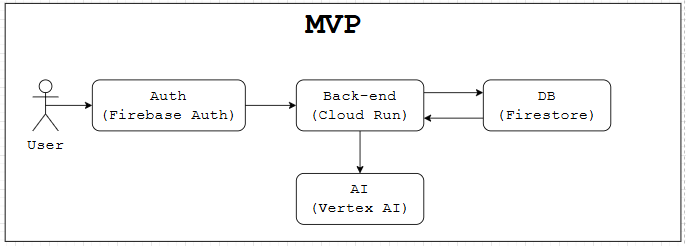
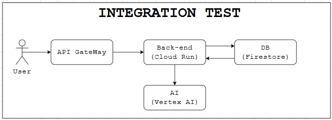
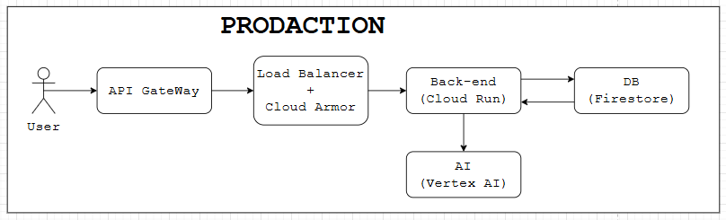

# Отчет по лабораторной №4

University: [ITMO University](https://itmo.ru/ru/)\
Faculty: FTMI\
Course: [Cloud platforms as the basis of technology entrepreneurship](https://itmo-ict-faculty.github.io/cloud-platforms-as-the-basis-of-technology-entrepreneurship/)\
Year: 2025/2026\
Group: U4225\
Author: Laptev Anatoly Aleksandrovich\
Lab: Lab4\
Date of create: 29.11.2025\
Date of finished: 01.12.2025

1. Вам необходимо из исходных данных о приложении, накидать схему инфраструктуры, используя draw.io.\
Посчитать экономическую модель (расходы на содержание) и обосновать выбор тех или иных ресурсов.

2. Всего у приложения будет 3 состояния. Начальное, тестирование партнерами и продовое решение.\
Вам заранее необходимо подумать какое решение будет оптимальным исходя из предполагаемых нагрузок.\
Не всегда самое дешевое решение на первом этапе является оптимальным в дальнейшем.

### О приложении:
У меня нет никаких конкретных примеров такого приложения\
Пусть это бюудет не сложный Бэкенд являющийся прослойкой перед ИИ, как это часто делают, с небольшой БД для дданных юзеров

### Концептуальный набор компонентов
Модуль Входа - нечто между пользователем и входом
Модуль Сервиса - сам Бэкенд сервис, приложение
Модуль Хранения - База Данных для хранения инфы о пользователях и любые временные данные
Модуль ИИ - интеграция с ИИ

### MVP

Минимально работоспособный продукт, рассчитано на порядка 10-20 пользователей единовременно\
Бесплатный инструмент авторизации, Бэкенд с минимумом ресурсов, БД с выделенным минимумом ресурсов

Цена порядка 8-15$

### INTEGRATION TEST

Продукт для закрытого тестирования, рассчитано на порядка 100-500 пользователей единовременно\
Дешевый гейтвей, больше мощности на Бэкенде, больше ресурсов на БД

Цена порядка 100-150$

### PRODACTION

Полноценный продукт с хорошей защитой от DDOS рассчитанный на порядка 1000-2000 пользователей единовременно\
Балансер, армор, много мощности на БД и Прикладе, \
дорогая интеграция с ИИ для более быстрого ответа и большого количества токенов

Цена порядка 1000$